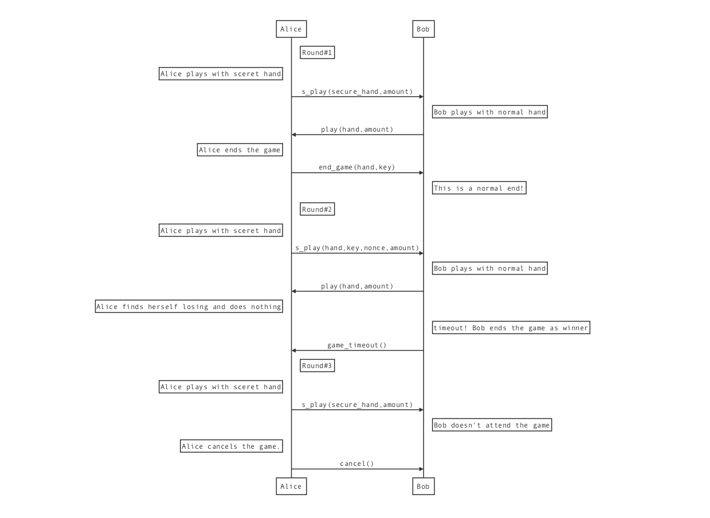
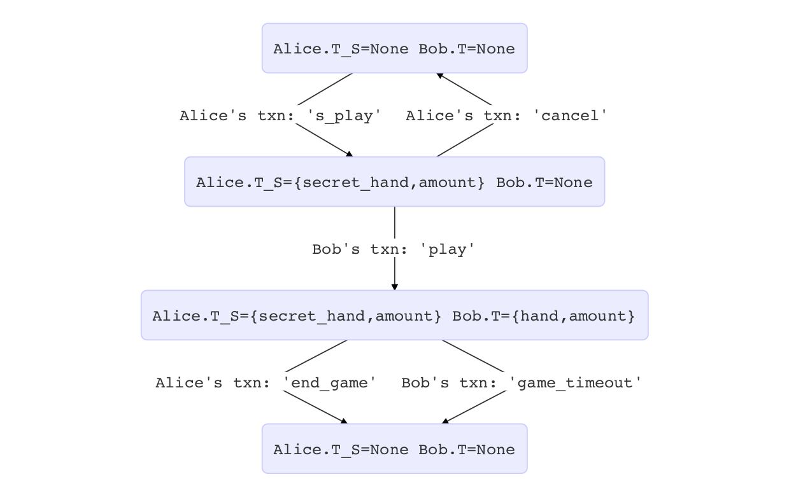

# RockPaperScissors
RockPaperScissors is a smart contract demo written with libra move ir (.mvir). Suppose you've successfully opened the channel according to the [gettingstarted document](../../gettingstarted.md).

1. Deploy Module to Chain

    In alice's cli
    ```
    dev dm demo/RockPaperScissors/module/rps.mvir

    ```

2. Install Script to Node

    Change all {{starlab}} in demo/RockPaperScissors/scripts to alice's address,
    then in alice cli execute
    ```
    dev ip demo/RockPaperScissors/scripts

    ```
    then in bob cli execute
    ```
    dev ip demo/RockPaperScissors/scripts.csp

    ```
3. Execute Scripts

     Alice plays with secret hand in her cli.
     "bde750a..." is the normal hand "72" (hex of "r"(石头)) encrypted with a key "616263"(hex of "abc").
     Specifically, secret hand is the sha3_256 result of "normal_hand+key".
     20 is her tokens.
    ```
    dev pe {bob} scripts rps_player_1 b"bde750abcf1d176a34cce61b607107092413100c9195b08f13d6e7d46980cf1c", 20
    ```
     Bob plays with normal hand in his cli. "70" is hex of "p"(剪刀), 10 is his tokens.
    ```
    dev pe {alice} scripts rps_player_2 b"70" 10
    ```
     Finally alice ends the game with the hand she has just played. "72" is hex of "r"(石头) and "616263" is the hex of the key "adc".
    ```
    dev pe {bob} scripts rps_end_game b"72" b"616263"
    ```

4. There are also other scenarios you can try:



5. For the developer who is interested in the RockPaperScissors module internal, please refer below State transition graph：



