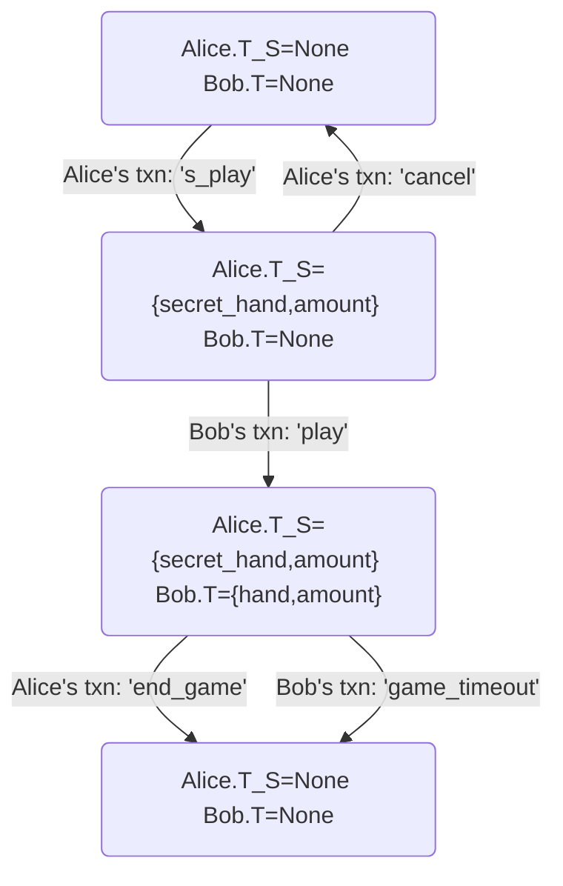

```mermaid

graph TD

A(Alice.T_S=None Bob.T=None) --> |Alice's txn: 's_play'| B(Alice.T_S=&#123secret_hand,amount&#125 Bob.T=None)
B --> |Bob's txn: 'play'| C(Alice.T_S=&#123secret_hand,amount&#125 Bob.T=&#123hand,amount&#125)
B --> |Alice's txn: 'cancel'|A
C -->|Alice's txn: 'end_game'| D(Alice.T_S=None Bob.T=None)
C -->|Bob's txn: 'game_timeout'| D

```

