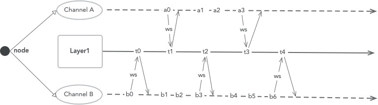

## SG layer2 存储设计 ##

### Layer2 流程 ###

### 存什么 ###

节点的每个 channel 都会有自己的交易历史记录(tx list)和链下状态数据(offchain state)。
1. 交易记录: 相互穿插的链上交易(onchain tx) + 链下交易(offchain tx) 历史。
2. 链下状态数据: 链下状态数据是执行链下交易生成的 writeset。
   - 初始状态是 empty 的。
   - 每当需要执行 onchain tx 时，将最近的链下状态数据带到链上执行。
   - onchain tx 执行完后，清空链下的状态数据。(拿到链上交易的write set，delete 所有的 access_path)
   - offchain tx 执行完后，将writeset 作为最新的 state 存入 storage。

### 怎么存 ###

1. 存储结构遵循 libra 的方式。
   - tx list: (channel_sender_address, channel_receiver_address, channel_seq_number) => tx
   - offchain state: (channel_receiver_address, version) => writeset
2. 和 libra 的区别，需要更改 key，加上 channel 相关的 address。

