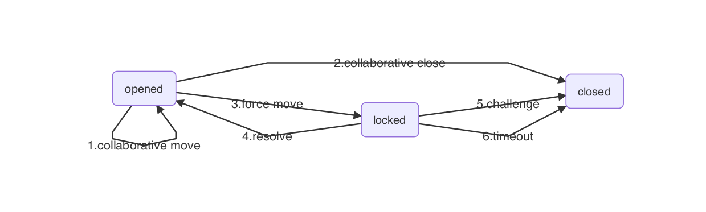
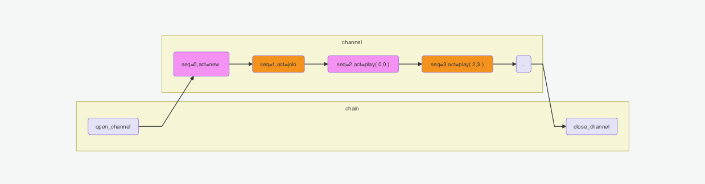
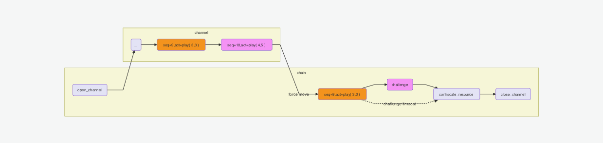
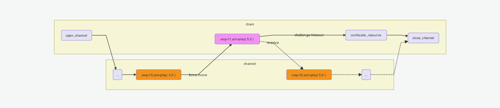
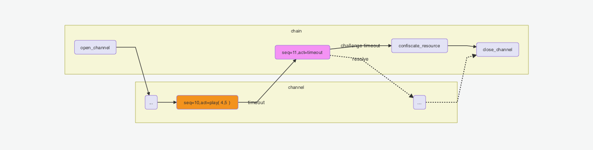

### Stargate智能合约编程框架

##### stargate状态通道

区块链技术亟待解决的主要问题之一是可扩展性的提升。状态通道作为一种Layer2技术方案，可以极大提升区块链的吞吐率。它具有即时确定性（Instant Finality）和费用低的特点，正在受到越来越多开发者的青睐。

状态通道的基本原理是通过在不同用户之间建立一个双向通道，参与者将区块链上的状态“锁定”在通道中。然后参与者开始在链下进行交易发送和验证，这些行为都不会被记录上链。每次更新状态通道总是要得到各方同意，也就是各方要对链下交易签名并保留副本。交易完成后参与者可以将最终状态记录上链，解除“锁定”的状态。

stargate作为一个支持Move智能合约的状态通道，既具有一般状态通道所具备的即时确定性和费用低的优点，同时也继承了Move合约天生的安全性高的优点。本文以“五子棋”游戏为例，结合stargate状态通道的工作模式，介绍一下stargate智能合约的编程框架。

##### stargate状态通道的工作模式

stargate状态通道工作在两种模式下：协作模式（collaborative play）和强制模式（force move）。



如上图所示，协作模式下状态通道处于opened状态，双方协作完成所有交易（步骤1），最后按照合约正常关闭通道（步骤2）。为了适应各种争议和解决争议（Disputes and resolutions），stargate状态通道提供了强制模式。当出现争议时，状态通道的参与方可以通过步骤3进入强制模式，另一方可以通过步骤4或者步骤5来解决冲突然，使状态通道进入关闭状态。同时，强制模式提供了步骤6，对参与方的不作为（Inactivity）进行处理。为了支持状态通道进入强制模式，stargate对状态通道做了如下扩展：

```
1.状态通道里的资源分为私有资源和共享资源。交易里单方修改对方的私有资源需要对方授权，如果对方拒绝则交易无效。交易里单方修改共享资源或者自己的私有资源则不需要对方授权，只要交易满足合约约束。

2.单方可以在链上强制执行链下交易，只要不修改对方私有状态。单方执行交易后状态通道处于锁定状态：
-  对方如果认可认可状态，可以调用解锁方法解锁，解锁后状态通道恢复正常，双方可继续交易。
-  如果对方不认可，可提交自己本地最新的状态进行挑战，挑战成功后，状态通道基于自己提交的状态清算，作为惩罚，对方押金归自己。
-  如果对方一直不响应，等待挑战期过后，通道基于当前状态清算。
```

##### 协作模式

下面我们将以五子棋为例对状态通的两种工作模式进行详细说明。五子棋是大家非常熟悉的棋牌类游戏，参与游戏的双方分别使用黑、白色旗子轮流下棋，直到其中一方五子连成一线。如果参与双方都能及时对对手提交的交易进行签名确认，通道的状态变化就会从上图opened状态开始，经由步骤1、2，协作完成如下图所示的所有交易，最终进入closed状态。下图中紫色和棕色分别代表不同的参与者提交的交易，灰色表示可能是参与者中任意一方提交的交易。先由一方提交open_channel交易到链上打开状态通道，然后双方轮流在通道上执行链下交易，最后再由任何一方提交close_channel交易到链上将通道关闭。

图一：



#####强制模式

如果参与者中有一方没有及时对对手提交的交易进行签名确认，另一方可以单方提交交易到链上，此时状态通道进入强制模式。还是以五子棋为例，我们先对五子棋中可能产生的争议进行分类，然后再针对各种争议在强制模式下如何解决进行说明。

争议可以分为两类。第一类争议是参与方伪造，第二类是参与者不作为（Inactivity）。

先介绍第一类争议：参与者伪造交易。为了理解参与者如何伪造交易，首先要区分什么是真实交易什么是假交易。真实的交易具有两个特点：不仅要(i)符合合约，而且(ii)其前置交易是双方签名认可的。任何不满足这两个条件中任意一个的交易都是假交易，假交易是无法上链的，要么签名校验通不过，要么不符合合约无法执行。唯一无法被链识别的伪造交易是“旧”交易，它符合合约，其前置交易也得到双方认可，但是它不是最新的双方签名过的交易，会引发争议。

```
参与者将“旧”交易单方上强制上链，另一方可以用最新的双方签名认可的前置交易进行挑战（Challenge）
```



参与者不作为（Inactivity）导致状态迁移无法进行。可以分为a、b两种情况：

```
a.参与者的网络连接有问题或者密钥丢失了无法签名，也可能参与者看到新状态对自己不利从而故意不签名，这些情况下对手可以单方强制执行
```

```
b.参与者签名了，但是故意不走下一步，合约规定的等待时间过后，另一方可以单方强制执行合约提供的Timeout交易
```



##### stargate状态通道编程接口

协作模式编程接口：

```rust
module LibraAccount {

    public enable_channel();

    public open_channel(participant: address, sender_amount: u64, participant_amount: u64);

    public close_channel(participant: address);

    public deposit_to_channel(coin: LibraCoin.T);

    public deposit_to_participant(participant: address, coin: LibraCoin.T);

    public withdraw_from_channel(amount: u64): LibraCoin.T;

}

module ChannelUtil {

    public move_to_participant<T: resource>(participant: address, t: T);

    public move_to_shared<T: resource>(t: T);

    public move_from_participant<T: resource>(participant: address): T;

    public move_from_shared<T: resource>(): T;

    public borrow_from_participant<T: resource>(participant: address): & T;

    public borrow_from_participant_mut<T: resource>(participant: address): &mut T;

    public borrow_from_shared<T: resource>(): & T;

    public borrow_from_shared_mut<T: resource>(): &mut T;

    public exist_channel_participant<T: resource>(participant: address): bool;

    public exist_channel_shared<T: resource>(): bool;

}

```

强制模式编程接口：

合作模式下参与者通过stargate钱包客户端将交易发送给对方进行签名，当对方不协作时可通过钱包提供的`force execute`命令将满足条件的交易强制上链执行。

```rust
module LibraAccount {

    public resolve();

    public challenge();

    public close_after_timeout(violator: address);

}
```

接口的使用方法可参考接口文档（链接），并结合五子棋demo源码（链接）进行理解。下面我们仅给出五子棋核心部分代码：

```rust
resource Shared {
    whose_turn: address,  // Alternate between black and white
    block_height: u64,
    status: u64,  // 0 newed, 1 joined, 2 closed
}
public play(receiver: address, x: u64, y: u64): u64 {
    let win: bool;
    let status: u64;

    status = Self.status();
    if (copy(status) != 1) {
        return 3; // wrong status, return
    }

    if (!Self.is_my_turn()) {
        return 1; // it's not your turn, return
    }

    if (!Self.is_blank(copy(x), copy(y), copy(receiver))) {
        return 2; // (x,y) is not blank
    }

    Self.set_value(copy(x), copy(y), copy(receiver));
    win = Self.is_five(move(x), move(y));
    if (move(win)) {
        Self.end_game(true);
    }

    return 0;
}
```

##### stargate状态通道的适用范围

stargate是一个通用的状态通道，智能合约履行过程中，并不要求参与者必须像五子棋那样交替轮流提交交易，理论上只要是符合MOVE规范的智能合约，都可以通过stargate编程接口进行扩展，在状态通道中执行。


