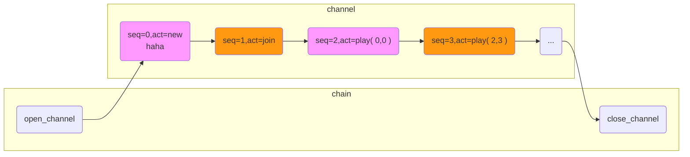

```mermaid
graph LR

S0(open_channel)
S1(seq=0,act=new <br/>haha)
S2(seq=1,act=join)
S3(seq=2,act=play&#40 0,0 &#41)
S4(seq=3,act=play&#40 2,3 &#41)
S5(...)
S7(close_channel)
style S1 fill:#f9f
style S3 fill:#f9f
style S2 fill:#f91
style S4 fill:#f91
subgraph chain
S0
S7
end
subgraph channel
S0-->S1-->S2-->S3-->S4-->S5-->S7
end

```