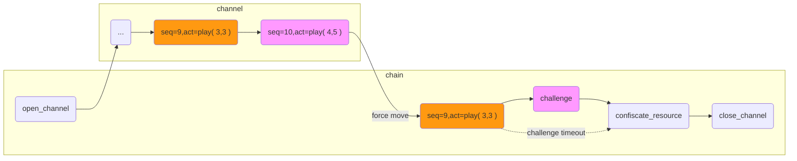

```mermaid
graph LR

S0(open_channel)
S3(...)
S4(seq=9,act=play&#40 3,3 &#41)
S5(seq=10,act=play&#40 4,5 &#41)
S6(seq=9,act=play&#40 3,3 &#41)
S7(challenge)
S9(confiscate_resource)
S10(close_channel)
style S4 fill:#f91
style S5 fill:#f9f
style S6 fill:#f91
style S7 fill:#f9f
subgraph chain
S0
S6
S9
S6-->S7-->S9-->S10
S6-.->|challenge timeout|S9
end
subgraph channel
S0-->S3-->S4-->S5-->|force move|S6
end

```