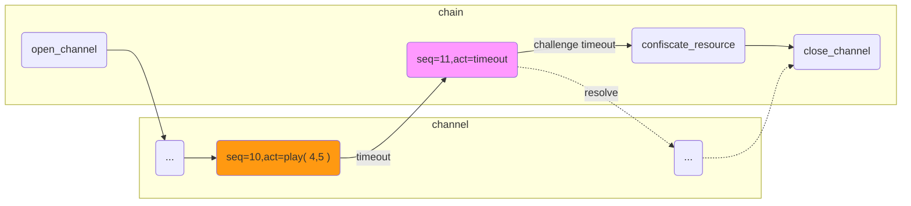

```mermaid
graph LR

S0(open_channel)
S4(...)
S5(seq=10,act=play&#40 4,5 &#41)
S6(seq=11,act=timeout)
S8(...)
S9(confiscate_resource)
S10(close_channel)
style S5 fill:#f91
style S6 fill:#f9f
subgraph chain
S0
S6
S9
S6-->|challenge timeout|S9-->S10
end
subgraph channel
S0-->S4-->S5-->|timeout|S6-.->|resolve|S8-.->S10
end

```